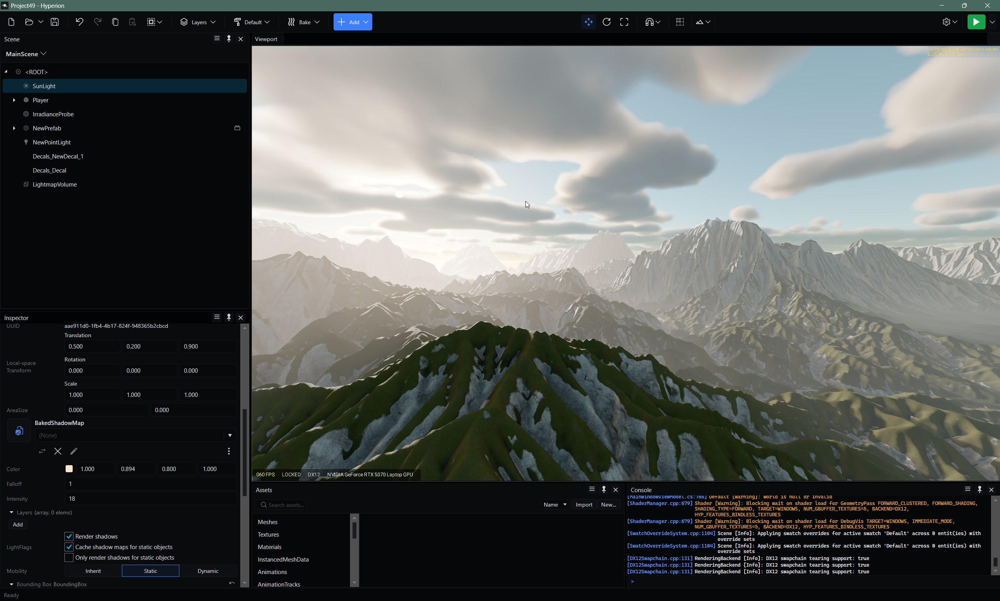

  

    <a href="https://hyperionengine.dev">Website</a> • <a href="https://discord.gg/Fv8PwMJEUb">Discord</a>

  

## About

Hyperion started as a passion project in 2016 (forked from [apex-engine](https://github.com/ajmd17/apex-engine)), and is still worked on daily.
Our aim with Hyperion is to offer a high fidelity gaming experience even on low-end hardware using our in-house baking system to prepare as much of the lighting and effects as possible ahead of time.

## Screenshots
| | |
|:---:|:---:|
|  |  |
| Baked lightmaps and reflections | Multiplayer, in play-in-editor mode |

## Some Features
- Clustered deferred shading supporting a large number of dynamic lights while maintaining good frame times. Uses forward clustered shading for translucent materials.
- Visual editor on Windows and macOS, built with Avalonia.
- Offline lightmapper integrated into the editor. Bake lightmaps into the scene,  reflection/irradiance probes for dynamic objects, fog volumes, and other static lighting data such as shadow maps.
- Real time global illumination and reflections via Ray tracing and screen-space options for non-RT capable hardware.
- Shader compiler system with built in permutations support, and live reload in editor to see changes as you make them.
- Scripting via the [Strata programming language](https://github.com/StrataLanguage/stratac) - JIT compiled, live reload in editor, or AOT linking with shipping builds
- Level streaming via grid-based streaming
- Basic multiplayer setup, with a dedicated server, client-side prediction, replication, etc

## Platforms
Currently, we are focusing our efforts on developing the engine for *Windows*, *macOS*, *Android*, *iOS*, and Steam Deck via Proton. Editor support is available on Windows and macOS. Linux support is planned.

## Getting started
Documentation is a WIP but we have some available on our site: [Documentation](https://hyperionengine.dev/docs)
For any questions you have, please feel free to ask away in [Discord](https://discord.gg/Fv8PwMJEUb).

## Credits
- [Avalonia](https://github.com/AvaloniaUI/Avalonia)
- [Dock.Avalonia](https://github.com/wieslawsoltes/Dock)
- [Codicons](https://github.com/microsoft/vscode-codicons)
- [Material Icons](https://github.com/google/material-design-icons)
- [meshoptimizer](https://github.com/zeux/meshoptimizer)
- [V-HACD](https://github.com/kmammou/v-hacd)
- [xatlas](https://github.com/jpcy/xatlas)
