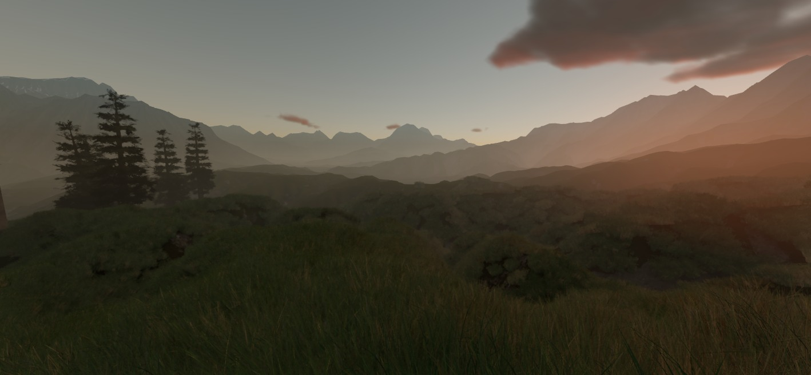
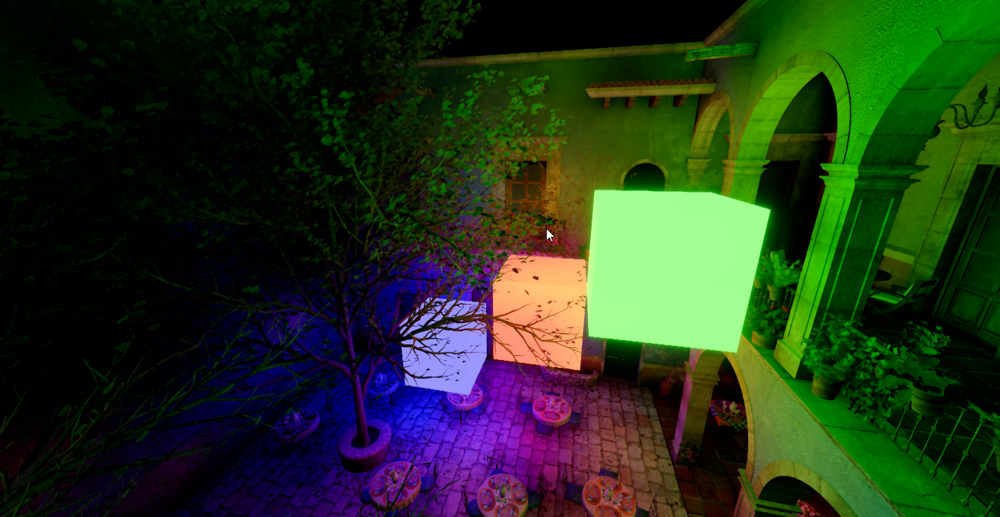
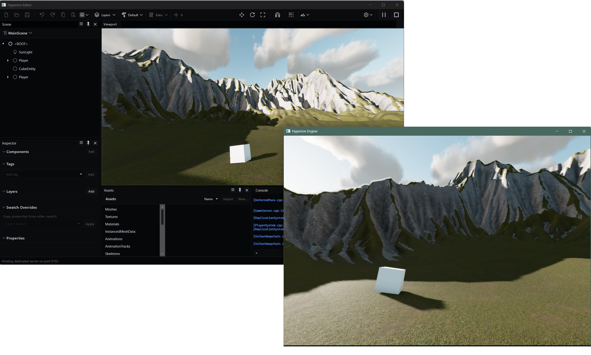

  

    <a href="https://hyperionengine.dev">Website</a> • <a href="https://hyperionengine.dev/docs">Documentation</a> • <a href="https://discord.gg/Fv8PwMJEUb">Discord</a>

  

## About

Hyperion is a full-featured, general-purpose game engine built from the ground up in C++. It has been developed continuously since 2016, with a focus on high-fidelity rendering and scalable worlds without requiring high-end hardware.

The engine is built around a set of tightly integrated subsystems that share common reflection, resource, serialization, tooling, and runtime infrastructure.

## Why Hyperion?

- **Dynamic GI without RT hardware.** Glimmer traces probes in software for the near field and falls back to spherical harmonics in a voxel grid for the far field. On low end devices you can skip the tracing entirely and run on the voxel grid alone.
- **Reflection makes it EZPZ** Mark a class, struct, or field for reflection and our build tools will allow it to be used in serialization, editing, network replication, and script bindings
- **Multiplayer you can test in the editor.** play-in-editor can run as a client, by starting a server others can connect to - or connect to another running server altogether
- **Write the entire game in C# or C++** Use C# for scripting or write the entire game in it (see CSharpGame sample). Or generate a C++ project that links to Hyperion, then build and package it from the editor.

## Screenshots
<table>
  <tr>
    <td width="50%" valign="top" align="center">
       
      Glimmer - Emissives
    </td>
    <td width="50%" valign="top" align="center">
       
      Multiplayer, in play-in-editor mode
    </td>
  </tr>
</table>

<!-- |  |  |
| Glimmer - realtime GI | Lightmaps - baked offline, static only | -->

## Features

Click a section to expand it.

<b>Rendering</b>

- **Clustered deferred shading** supporting a large number of dynamic lights while maintaining good frame times, with forward clustered shading for translucent materials.
- **Glimmer GI** - our (non-hardware RT required!) global illumination system. Dynamic diffuse lighting from software ray traced probes in the near field and spherical harmonics encoded into a voxel grid for far field (can also opt out of SWRT and just use the fallback for better perf on low end!)
- **Offline lightmapper** integrated into the editor. Bakes lightmaps into the scene, reflection/irradiance probes supported for dynamic objects, fog volumes, and other static lighting data such as shadow maps.
- Real time reflections via ray tracing on RT capable hardware, with screen-space reflections everywhere else.
- **Automatic instancing.** Entities sharing a mesh, material, and LOD can be batched into instanced draw calls automatically
- Indirect draws, Hi-Z occlusion culling, bindless textures, mesh LODs
- Lights: directional, point, spot, and textured rectangular area lights. Cascaded and omnidirectional shadow maps with static/dynamic caching.
- PBR materials with parallax mapping, transmission, emissives, and foliage shading.
- Post: TAA, HBAO, bloom, AgX / ACES / PBR Neutral tonemapping, color grading.
- GPU particles, simulated in compute with depth-buffer collision.
- Backends: DirectX 12 (the default on Windows) and Vulkan (macOS via MoltenVK, Android, and Linux in future). DirectX 12 is a fully supported, mainline backend.
- Shader compiler system with built in permutations support, and live reload in editor to see changes as you make them.

<b>Gameplay & scripting</b>

- **Scene graph + ECS hybrid.** Entities are nodes in a transform hierarchy and carry plain-data components (mesh, rigid body, character controller, animation, audio, script, UI, ...). Systems run over component sets in execution groups, in parallel where possible.
- **Write it in C# or C++**
  - C# can be used either as a scripting language for gameplay code, or even as your entire game! Look at our CSharpGame sample to see how you can build a game with C#.
  - You can generate a CMake project for your game that links to Hyperion by opening the editor and clicking *Build* > *Generate C++ Project*. From this menu, you can also build and package your game.
- **Reflection and codegen.** Tag a class, struct, or field and it gets serialization, an editor inspector, network replication, and C# + script bindings
- Extend the engine with your own components, systems, world subsystems, `Entity` subclasses, or a `Game` subclass.
- Input: keyboard/mouse, touch with on-screen controls on mobile targets, gamepads via Steam Input. First-person, third-person, and follow camera controllers included.

<b>Editor</b>

- Runs on Windows and macOS, built with Avalonia.
- **Play-in-editor**, including multiplayer: standalone, as client, or against a dedicated server.
- **World building tools:** terrain sculpting and layer painting, ground cover painting, prefab instance painter, decal painter.
- **CSG booleans** (union/subtract/intersect), basic mesh edits, convex collision generation via V-HACD.
- Bake lightmaps, probes, static shadows, and fog volumes

<b>World</b>

- **Terrain:** streamed cells with geomorphic lod (CDLOD). Splat painting supported, as well as auto splats based on the shape of the terrain. Collision is supported
- **Ground cover and grass:** ground cover is automatically planted onto the terrain on load, can be painted as well.
- **Level streaming:** grid-based world layers streamed around streaming volumes on a dedicated thread
- Procedural atmosphere sky, volumetric clouds with cloud shadows, height fog, and baked fog volumes (baking draws static lights' scattering into a 3D texture)
- Deferred decals and clustered instance groups

<b>Networking</b>

- Server authoritative entity replication
- Component replication driven by reflection, entity ownership, and interest management
- Client-side prediction for character movement
- Dedicated server (`--server`)

<b>Physics</b>

- [Jolt](https://github.com/jrouwe/JoltPhysics) backend. Static, dynamic, and kinematic bodies
- Convex decomposition (V-HACD) from the editor.
- Character controller support

<b>Animation</b>

- Skeletal animation with GPU skinning. Import from FBX, glTF

<b>UI</b>

- In-game UI is a custom retained-mode system, drawn by the engine's own renderer (the editor is separate, and uses Avalonia).
- Widgets: button, text, textbox, image, panel, grid, list view, tab view, menu bar, window, dockable container.
- XML markup with event handlers bound to script methods; list views bind to data sources. Fill/auto/percent sizing, alignment, and padding.
- TrueType/OpenType text via FreeType.

<b>Audio</b>

- 3D positional audio via OpenAL, with the listener following the active camera
- Audio sources are components on entities: position, velocity, pitch, gain, and looping

<b>Assets</b>

- Import: FBX, glTF/GLB, OBJ, OgreXML models
- PNG, JPG, TGA, BMP, PSD, HDR, TIF, GIF textures via STB image
- WAV audio
- TTF/OTF fonts
- UUID-based asset registry with redirects, so renaming and moving assets doesn't break references.
- Async batch loading, with memory-mapped blob storage paged in on demand.
- Content cooking, plus a cache server so a team (or your devices) can pull cooked content over HTTP instead of cooking locally.
- Automatic mesh LOD generation.

<b>Core & tooling</b>

- Our own containers, strings, smart pointers, allocators, and pools.
- Task system and scheduler on top of a thread pool, with a built in data race detector.
- Scoped profiling, sockets, HTTP and WebSocket, compression.
- **Commandlets:** isolated tasks (cooking textures, precompiling shaders, ...) that run from the editor console, from the CLI with `--exec`, or as their own executable.
- **CVars** for tweaking engine behavior at runtime, loaded from config and settable from the console.

## Platforms
Currently, we are focusing our efforts on developing the engine for *Windows*, *macOS*, *Android*, *iOS*, and Steam Deck via Proton. Editor support is available on Windows and macOS. Linux support is planned.

## Status
Hyperion is in active development. APIs, editor workflows, and asset formats can still change between versions.

## Getting started
Clone with `--recursive` to pull in submodules, then run `build.bat Release` on Windows or `./build.sh Release` on macOS. You'll need CMake and the .NET 10 SDK, plus vcpkg (`VCPKG_ROOT` set) on Windows or the Vulkan SDK on macOS and Android. See [Compiling the Engine](Documentation/CompilingTheEngine.md) for the full list and per-platform notes.

Documentation is a WIP but we have some available on our site: [Documentation](https://hyperionengine.dev/docs)
For any questions you have, please feel free to ask away in [Discord](https://discord.gg/Fv8PwMJEUb).

## AI
AI can be a useful tool, but intention is important when building something super complex like a game engine. We aim to keep the usage of AI-generated code limited to bug fixes, UI changes, and occasionally, prototyping / boilerplate. In an effort to maintain transparency, we aim to note where AI is used generally as part of a commit message, comment on the commit on GitHub, or on the PR; although this is on a best effort basis. 

We expect contributors to be honest and upfront about the usage of AI generated code and while AI-generated code isn’t de facto unacceptable, the code must pass the same quality bar that human generated code would. 

## Credits
- [Avalonia](https://github.com/AvaloniaUI/Avalonia)
- [Dock.Avalonia](https://github.com/wieslawsoltes/Dock)
- [Codicons](https://github.com/microsoft/vscode-codicons)
- [Material Icons](https://github.com/google/material-design-icons)
- [meshoptimizer](https://github.com/zeux/meshoptimizer)
- [V-HACD](https://github.com/kmammou/v-hacd)
- [xatlas](https://github.com/jpcy/xatlas)
- [manifold](https://github.com/elalish/manifold)
- [Jolt Physics](https://github.com/jrouwe/JoltPhysics)
- [FreeType](https://freetype.org/)
- [stb](https://github.com/nothings/stb)
- [OpenAL Soft](https://github.com/kcat/openal-soft)

Full list and licenses in [THIRD_PARTY_NOTICES.md](THIRD_PARTY_NOTICES.md).
